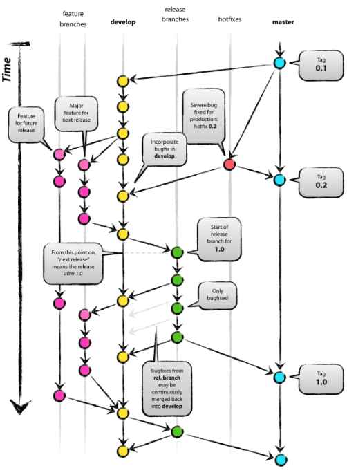

# Git-Flow 전략이 무엇인지 알아보기

* master : 제품으로 출시될 수 있는 브랜치
* develop : 다음 출시 버전을 개발하는 브랜치
* feature : 기능을 개발하는 브랜치
* release : 출시 버전을 준비하는 브랜치
* hotfix : 출시 버전에서 발생하는 버그를 수정하는 브랜치

* 처음에 master와 develop 브랜치가 같이 존재
  * develop 브랜치는 master 브랜치에서부터 시작된 브랜치
  * develop 브랜치에서는 상시로 버그를 수정한 커밋들이 추가
  * 새로운 기능 추가 작업이 있는 경우 develop 브랜치에서 feature 브랜치를 생성
  * 기능 추가 작업을 완료했다면 feature 브랜치는 develop 브랜치로 merge

